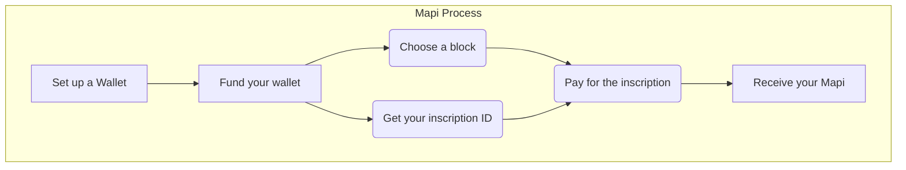

## Follow the Step by Step instructions below:

1. Set up a Bitcoin Ordinals wallet `(e.g. Unisat, ordinalswallet, ...)`.

2. Choose the block you wish to inscribe and enter the block number in the format `(e.g. 3.mapi)`.
   
4. Specify your inscription ID `("relay")`.

5. Pay for the inscription.
   
6. Complete the inscription and your `Mapi` will be added to the Bitcoin blockchain.
   
 

 

 
