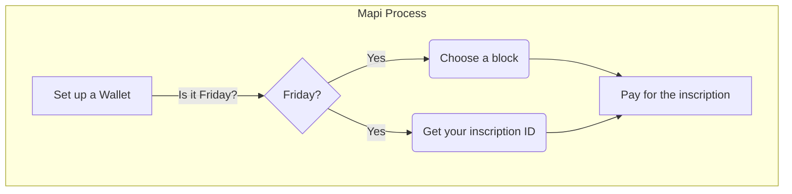

## Follow the Step by Step instructions below:

1. Set up a Bitcoin Ordinals wallet `(e.g. Unisat, ordinalswallet, ...)`.

2. Choose the block you wish to inscribe and enter the block number in the format `(e.g. 1.mapi)`.
   
4. Specify your inscription ID `("relay")`.

5. Pay for the inscription.
   
6. Complete the inscription and your `Mapi` will be added to the Bitcoin blockchain.
   
 

{ 
  "p": "sns",
  "op": "reg",
  "name": “1.mapi",
  "relay": "87295ff96556bc668c44068875aed32fbbbcebb8d5af3869fe37b264ba319a00i0"
}

 

 

st=>start: Start:>http://www.google.com[blank]
e=>end:>http://www.google.com
op1=>operation: My Operation
sub1=>subroutine: My Subroutine
cond=>condition: Yes
or No?:>http://www.google.com
io=>inputoutput: catch something...
para=>parallel: parallel tasks

st->op1->cond
cond(yes)->io->e
cond(no)->para
para(path1, bottom)->sub1(right)->op1
para(path2, top)->op1

